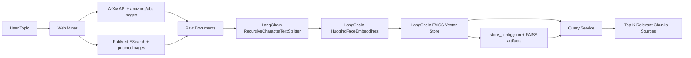

# AI-Powered Scientific Search Engine (Simple NLP RAG Baseline)

This project builds a small but functional pipeline that:

1. Mines scientific web pages from **ArXiv** and **PubMed**
2. Extracts textual content (title + abstract)
3. Splits text into meaningful chunks (LangChain splitter)
4. Creates embeddings for chunks (LangChain HuggingFace embeddings)
5. Stores vectors in a local FAISS index (LangChain vector store)

## System Design




## Why this design

- **Simple and robust**: Uses standard HTTP endpoints + HTML parsing.
- **Meaningful splitting**: LangChain `RecursiveCharacterTextSplitter` preserves context better than naive fixed slicing.
- **Fast retrieval**: LangChain FAISS vector store provides efficient local retrieval.
- **Traceability**: Each result includes source URL and document metadata.

## Project Structure

- `AI-Powered-Scientific-Search-Engine/app/miner.py`: ArXiv/PubMed page mining
- `AI-Powered-Scientific-Search-Engine/app/chunking.py`: LangChain text splitting
- `AI-Powered-Scientific-Search-Engine/app/vector_store.py`: LangChain embeddings + FAISS persistence + search
- `AI-Powered-Scientific-Search-Engine/app/api.py`: FastAPI service (`/health`, `/build-index`, `/query`)
- `AI-Powered-Scientific-Search-Engine/main.py`: ASGI app entrypoint for `uvicorn`
- `AI-Powered-Scientific-Search-Engine/tests/test_api.py`: API tests with FastAPI `TestClient`

## Setup

```bash
cd AI-Powered-Scientific-Search-Engine
uv sync
```

Optional configuration:

- Set `SCISEARCH_VECTOR_STORE_DIR` to control where the vector index is persisted (default: `data/vector_store`).

## Run the API

Default (`uv`):

```bash
uv run uvicorn main:app --reload --port 8000
```

Alternative (direct Python):

```bash
source .venv/bin/activate
python -m uvicorn main:app --reload --port 8000
```

## Prototype E2E Run (Endpoint-Only)

Focused domain for the prototype:

- `large language models for biology`

This run uses ArXiv full PDFs (5-10 papers recommended), builds the index, and runs retrieval queries entirely via API endpoints.

1. Start the API.

Default (`uv`):

```bash
uv run uvicorn main:app --reload --port 8000
```

Alternative (direct Python):

```bash
source .venv/bin/activate
python -m uvicorn main:app --reload --port 8000
```

2. Build the index from ArXiv (full PDFs).

Note: The `out_dir` directory is created automatically when `/build-index` runs.

```bash
curl -X POST http://127.0.0.1:8000/build-index \
  -H "Content-Type: application/json" \
  -d '{
    "topic": "large language models for biology",
    "arxiv_docs": 8,
    "pubmed_docs": 0,
    "chunk_size": 1200,
    "chunk_overlap": 1
  }'
```

3. Query the built index.

```bash
curl -X POST http://127.0.0.1:8000/query \
  -H "Content-Type: application/json" \
  -d '{
    "query": "How are LLMs used for biological sequence modeling?",
    "top_k": 5
  }'
```

The `/build-index` response includes:

- Exact papers indexed (arXiv ID + title + PDF URL + local path)
- Index/chunk counts and output directory

## Build an Index (HTTP)

Note: You do not need to pre-create `SCISEARCH_VECTOR_STORE_DIR` (default `data/vector_store`). The API creates it during `/build-index`.

```bash
curl -X POST http://127.0.0.1:8000/build-index \
  -H "Content-Type: application/json" \
  -d '{
    "topic": "large language models for drug discovery",
    "arxiv_docs": 8,
    "pubmed_docs": 0,
    "chunk_size": 550,
    "chunk_overlap": 1
  }'
```

Output:

- `data/vector_store/index.faiss`
- `data/vector_store/index.pkl`
- `data/vector_store/store_config.json`

## Query the Index (HTTP)

```bash
curl -X POST http://127.0.0.1:8000/query \
  -H "Content-Type: application/json" \
  -d '{
    "query": "Which papers discuss LLM-based molecule generation?",
    "top_k": 5
  }'
```

## Test (FastAPI)

Default (`uv`):

```bash
uv run pytest -q
```

Alternative (direct Python):

```bash
source .venv/bin/activate
python -m pytest -q
```

## Tradeoffs and Notes

- This baseline now indexes **ArXiv full PDFs** (for ArXiv docs) and PubMed abstracts (if enabled).
  - Pro: better coverage of methods/details for retrieval.
  - Con: larger documents increase embedding/indexing time.
- HTML selectors can change over time; production code should include parser tests and fallback extraction.
- For larger corpora, move metadata from JSON to SQLite/Postgres and use a scalable vector DB.
- Re-ranking (cross-encoder) can improve precision but adds latency and complexity.
